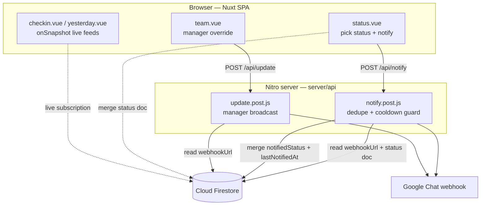
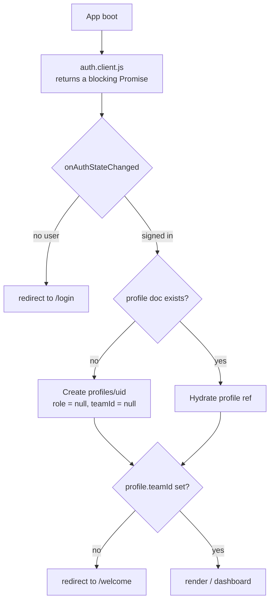
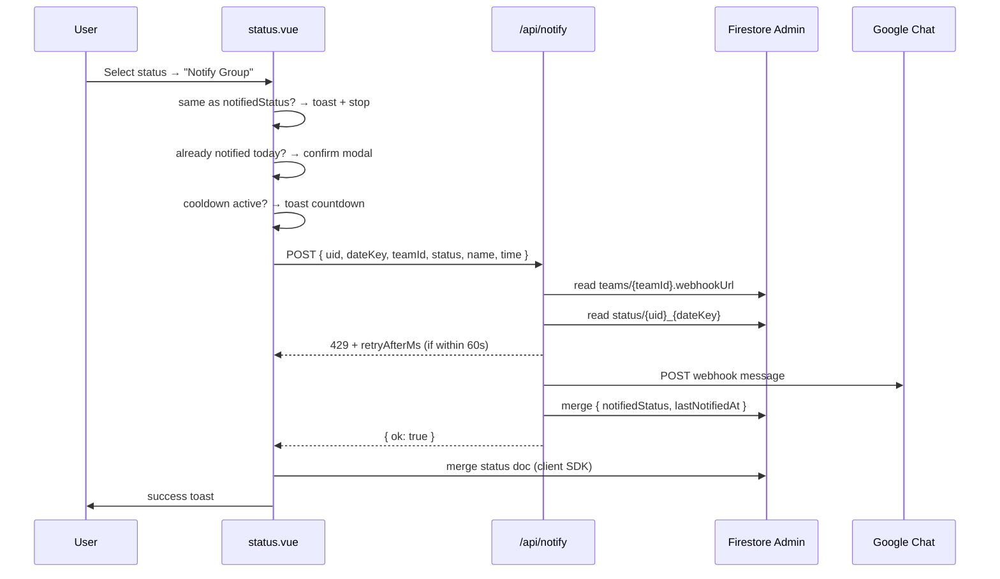

# Status Tracker

A team availability / daily check-in tracker built with **Nuxt 4** and **Firebase**. Team members post their daily work status (In Office, Work From Home, On Leave); the app records it in Firestore and pushes a formatted message to the team's **Google Chat webhook**.

Managers get an extra console to manage members, override anyone's status, and configure the team webhook.

---

## Table of Contents

1. [Feature Overview](#feature-overview)
2. [Tech Stack](#tech-stack)
3. [Architecture](#architecture)
4. [Project Structure](#project-structure)
5. [Data Model](#data-model)
6. [Authentication & Routing Flow](#authentication--routing-flow)
7. [The Notification Pipeline](#the-notification-pipeline)
8. [Server API Reference](#server-api-reference)
9. [Frontend Concepts](#frontend-concepts)
10. [Theming](#theming)
11. [Setup & Installation](#setup--installation)
12. [Environment Variables](#environment-variables)
13. [Available Scripts](#available-scripts)
14. [Deployment](#deployment)
15. [Security Notes (Read Before Production)](#security-notes-read-before-production)
16. [Troubleshooting](#troubleshooting)
17. [Conventions & Gotchas](#conventions--gotchas)
18. [Roadmap](#roadmap)
19. [Author](#author)
20. [Acknowledgements](#acknowledgements)
21. [License](#license)

---

## Feature Overview

### For every member

| Feature                      | Description                                                           |
| ---------------------------- | --------------------------------------------------------------------- |
| Daily status check-in        | Pick `In Office` / `Work From Home` / `On Leave` and notify the team  |
| Google Chat notification     | Posts a formatted message to the team's configured webhook            |
| Duplicate protection         | Re-sending the _same_ status the same day is a no-op                  |
| Repeat confirmation          | Changing status after already notifying prompts a confirm modal       |
| Cooldown with live countdown | 60s minimum gap between sends, surfaced as a `mm:ss` timer in the UI  |
| Today's check-ins feed       | Live (`onSnapshot`) list of everyone in the team who checked in today |
| Yesterday's overview         | Snapshot of the previous day's statuses                               |
| Personal reports             | This week / last week / this month / last month history with counts   |
| Dark mode                    | Persisted in `localStorage`, applied before hydration to avoid flash  |
| Mobile responsive            | Collapsible sidebar, stacked cards, body-teleported modals            |

### For managers only (`role === "Manager"`)

| Feature                | Description                                                               |
| ---------------------- | ------------------------------------------------------------------------- |
| Team console (`/team`) | Live member list with role, today's status and actions                    |
| Join code sharing      | 6-digit code + copy-to-clipboard                                          |
| Webhook configuration  | Set/update the team's Google Chat webhook URL                             |
| Status override        | Change any member's status; posts an "Updated by Manager" webhook message |
| Remove member          | Detaches the profile from the team and decrements the member count        |

---

## Tech Stack

| Layer             | Technology                                                    |
| ----------------- | ------------------------------------------------------------- |
| Framework         | Nuxt `^4.4.2` (SPA mode — `ssr: false`)                       |
| UI                | Vue `^3.5.30`, Composition API (`<script setup>`), scoped CSS |
| Routing           | Nuxt file-based routing + `vue-router@5`                      |
| Auth              | Firebase Authentication (Email/Password + Google popup)       |
| Database          | Cloud Firestore (client SDK + Admin SDK)                      |
| Server            | Nitro server routes (`server/api/*`)                          |
| Notifications     | Google Chat incoming webhooks                                 |
| Toasts            | `vue-toastification@2.0.0-rc.5`                               |
| Admin/server auth | `firebase-admin@^13.6.0`                                      |

---

## Architecture



**Key architectural decision:** the webhook call happens **before** the Firestore status write in the member flow. If the webhook fails (cooldown, bad URL, network), nothing is persisted — so the stored status never claims something the team was never told.

---

## Project Structure

```
status-tracker/
├── app/
│   ├── app.vue                  # Root — renders NuxtLayout/NuxtPage directly
│   ├── assets/css/theme.css     # Design tokens + ui-* utility classes
│   ├── components/
│   │   ├── status.vue           # Status picker + notify + cooldown + confirm modal
│   │   ├── checkin.vue          # Today's live check-in feed
│   │   ├── yesterday.vue        # Yesterday's overview grid
│   │   ├── sidebar.vue          # Nav (Today / Reports / Manage Team*)
│   │   └── topbar.vue           # Header, theme toggle, sign out
│   ├── composables/
│   │   ├── useUser.js           # Singleton refs: user, profile, isLoaded
│   │   ├── useTheme.js          # Dark mode state + localStorage persistence
│   │   ├── useSidebar.js        # Mobile drawer open/close (useState)
│   │   └── useInitials.js       # Avatar initials helper
│   ├── layouts/
│   │   ├── default.vue          # Sidebar + topbar shell (authed app)
│   │   ├── auth.vue             # Bare layout for login/signup/reset
│   │   └── welcome.vue          # Topbar-only onboarding shell
│   ├── middleware/
│   │   ├── auth.js              # Session + team-membership gate
│   │   └── manager.js           # Role gate for /team
│   ├── pages/
│   │   ├── index.vue            # Dashboard: status + checkin + yesterday
│   │   ├── reports.vue          # Personal history with date presets
│   │   ├── team.vue             # Manager console
│   │   ├── login.vue  signup.vue  reset.vue
│   │   └── welcome/
│   │       ├── index.vue        # Create vs Join choice
│   │       ├── create.vue       # Create team (becomes Manager)
│   │       └── join.vue         # Join via 6-digit code (becomes Member)
│   └── plugins/
│       ├── auth.client.js       # Blocking auth bootstrap + profile hydration
│       └── toast.client.js      # vue-toastification registration
├── firebase/config.js           # Client Firebase SDK init (auth, db)
├── server/
│   ├── api/
│   │   ├── notify.post.js       # Member check-in → webhook (guarded)
│   │   └── update.post.js       # Manager override → webhook
│   └── utils/firebaseAdmin.js   # Lazy Admin SDK init from env credential
├── functions/index.js           # Legacy Cloud Function (updateStatus)
├── firestore.rules              # ⚠️ currently wide open — see Security Notes
├── firebase.json                # Firestore/functions/dataconnect config
└── nuxt.config.ts               # SPA mode, fonts, theme pre-hydration script
```

---

## Data Model

### `profiles/{uid}`

Created automatically on first sign-in by `app/plugins/auth.client.js`.

```jsonc
{
  "name": "Asha Rao",
  "email": "asha@example.com",
  "role": "Manager", // "Manager" | "Member" | null (no team yet)
  "teamId": "AbC123...", // null until the user creates/joins a team
  "teamName": "Platform Team",
  "createdAt": 1753800000000,
  "updatedAt": 1753800000000,
}
```

### `teams/{teamId}`

```jsonc
{
  "name": "Platform Team",
  "joinCode": "482913", // 6 random digits, shared by the manager
  "managerId": "<uid>",
  "count": 4, // member count, maintained with increment()
  "webhookUrl": "https://chat.googleapis.com/v1/spaces/...",
  "createdAt": 1753800000000,
}
```

### `status/{uid}_{YYYY-MM-DD}`

Deterministic document ID = **one document per user per day**. The date key comes from `new Date().toLocaleDateString("en-CA")` (which yields `YYYY-MM-DD`).

```jsonc
{
  "uid": "<uid>",
  "name": "Asha Rao",
  "email": "asha@example.com",
  "status": "wfo", // "wfo" | "wfh" | "leave" — the user's CURRENT state
  "teamId": "AbC123...",
  "timestamp": 1753800000000,

  // written only by server/api/notify.post.js after a successful webhook send:
  "notifiedStatus": "In Office", // what the team was ACTUALLY told
  "lastNotifiedAt": 1753800000000, // used for the 60s cooldown
}
```

#### `status` vs `notifiedStatus` — why both exist

| Field            | Written by                        | Means                                         |
| ---------------- | --------------------------------- | --------------------------------------------- |
| `status`         | Client (`status.vue`, `team.vue`) | The user's intended/current state             |
| `notifiedStatus` | Server (`notify.post.js`)         | The last state actually broadcast to the team |

They can legitimately diverge — e.g. a manager overrides a member's status via `/api/update` (which does **not** touch `notifiedStatus`). Duplicate-send logic therefore reads `notifiedStatus` first and falls back to `status` for legacy documents:

```js
status: data.notifiedStatus ?? data.status ?? null;
```

> **Important:** every write to a `status` document must use `{ merge: true }`. A full `setDoc` replace wipes `notifiedStatus` / `lastNotifiedAt` and breaks cooldown + duplicate detection.

---

## Authentication & Routing Flow



1. **`app/plugins/auth.client.js`** returns a `Promise` that resolves only after the first `onAuthStateChanged` callback. Nuxt awaits plugins, so the app never renders before auth state is known — this is what prevents the flash-of-login-screen and hydration mismatches.
2. It hydrates the singleton refs from `useUser()` (`user`, `profile`, `isLoaded`) and creates the `profiles/{uid}` doc for brand-new users.
3. **`app/middleware/auth.js`** (applied per page via `definePageMeta`) enforces:
   - no session → `/login`
   - session but no `teamId` → `/welcome`
   - session **with** `teamId` on `/login` or `/signup` → `/`
   - Public paths: `/login`, `/signup`, `/reset`, `/welcome`
4. **`app/middleware/manager.js`** additionally guards `/team`, bouncing non-managers back to `/`.

Both middlewares short-circuit while `isLoaded` is `false` so they never act on half-hydrated state.

### Sign-up paths

- **Email/password** — `createUserWithEmailAndPassword` + `updateProfile(displayName)` + explicit `setDoc` on `profiles/{uid}`, then `/welcome`.
- **Google** — `signInWithPopup(GoogleAuthProvider)`; the auth plugin creates the profile doc if it's a first-time user.
- **Password reset** — `/reset` sends a Firebase reset email via `sendPasswordResetEmail`.

> The signup page seeds the shared `useUser()` profile ref immediately after writing to Firestore. This intentionally avoids a race where onboarding screens render before profile hydration catches up.

---

## The Notification Pipeline

### Member self check-in (`app/components/status.vue`)



**Client-side guards, in order:**

1. No status selected → warning toast.
2. `isPosting` already true → ignore (double-click protection).
3. Cooldown timer still running → info toast with remaining `mm:ss`.
4. Selected status equals `alreadyNotified.status` → info toast, request never leaves the browser.
5. A different status but already notified today → repeat-confirmation modal.

**Cooldown UX**

- The server returns `retryAfterMs` in the `429` payload.
- The client parses it defensively across `$fetch` error shapes (`err.data`, `err.data.data`, `err.response._data`, …) and falls back to the full 60s if only the status code is available.
- On page load, `lastNotifiedAt` from Firestore rehydrates the countdown, so a refresh doesn't hide an active cooldown.
- While counting down, the notify button is disabled and reads `Wait 00:42`, with helper text under the submit card.

### Manager override (`app/pages/team.vue`)

- Writes the target member's `status` document with `{ merge: true }`.
- Calls `/api/update`, which posts `Updated by Manager\n{name}\n {status} checked in at {time}`.
- Deliberately has **no** cooldown or duplicate guard — it's an administrative action.
- The confirm button shows a spinner + `Updating...` and disables both buttons during the request.

### Time formatting

Both flows format time identically so webhook messages stay consistent:

```js
new Date().toLocaleTimeString("en-IN", { hour: "numeric", minute: "2-digit" });
```

`minute: "2-digit"` keeps it zero-padded (`9:05 pm`, not `9:5 pm`).

---

## Server API Reference

### `POST /api/notify`

Member check-in broadcast with duplicate + rate-limit protection.

**Request body**

| Field     | Type   | Required | Notes                           |
| --------- | ------ | -------- | ------------------------------- |
| `uid`     | string | ✅       | Firebase user id                |
| `dateKey` | string | ✅       | `YYYY-MM-DD`                    |
| `teamId`  | string | ✅       | Used to look up the webhook URL |
| `status`  | string | —        | Human label, e.g. `In Office`   |
| `name`    | string | —        | Display name in the message     |
| `time`    | string | —        | Pre-formatted 12-hour time      |

**Responses**

| Status | Body                                                      | Meaning                             |
| ------ | --------------------------------------------------------- | ----------------------------------- |
| `200`  | `{ ok: true }`                                            | Sent and recorded                   |
| `200`  | `{ ok: true, skipped: true, reason: "duplicate-status" }` | Same status already broadcast today |
| `400`  | `teamId is required` / `uid and dateKey are required`     | Validation failure                  |
| `404`  | `Team not found`                                          | `teams/{teamId}` missing            |
| `429`  | `{ message, data: { retryAfterMs } }`                     | Inside the 60s cooldown             |
| `500`  | `Webhook URL not configured for this team`                | Team has no `webhookUrl`            |

Cooldown constant: `COOLDOWN_MS = 60_000` in `server/api/notify.post.js`.

### `POST /api/update`

Manager-initiated broadcast. Body: `{ name, status, time, teamId }`. Returns `{ ok: true }`, or `400` / `404` / `500` for missing `teamId`, unknown team, or unconfigured webhook. Performs no Firestore writes and applies no cooldown.

### `functions/index.js` (legacy)

An older `updateStatus` HTTPS Cloud Function that appends to a `users` collection. It is **not** part of the current flow — the Nitro routes replaced it. Safe to delete once you've confirmed nothing external calls it.

---

## Frontend Concepts

### Singleton composables

`useUser()` and `useTheme()` declare their `ref`s at **module scope**, so every component shares one instance:

```js
const user = ref(null);
const profile = ref(null);
const isLoaded = ref(false);
export function useUser() {
  return { user, profile, isLoaded };
}
```

`useSidebar()` uses Nuxt's `useState` instead, keying the drawer state as `"sidebarOpen"`.

### Live data

`checkin.vue`, `yesterday.vue`, `sidebar.vue` and `team.vue` subscribe with `onSnapshot(query(collection(db, "status"), where("teamId", "==", teamId)))` and filter client-side by date. Each component guards against `profile.teamId` not being hydrated yet by `watch`-ing until it appears, then unsubscribing the watcher.

`team.vue` cleans up all three listeners (`status`, `profiles`, `teams`) plus the copy-code timer in `onUnmounted`.

### Modals

Both `status.vue` and `team.vue` render their confirmation modals inside `<Teleport to="body">`. Combined with a fixed, `100dvh`, flex-centered overlay, this keeps dialogs centred regardless of parent scroll containers or transforms — including on mobile, where a locally-rendered modal previously drifted below the fold.

### Timestamp normalization

Status documents may store `timestamp` as a raw number **or** a Firestore `Timestamp`. Normalize before date filtering, otherwise members incorrectly show as "No Check-in".

---

## Theming

- All colors, spacing, radii, shadows and fonts are CSS custom properties in `app/assets/css/theme.css`.
- Dark mode = the `.dark` class on `<html>`, toggled by `useTheme()` and persisted to `localStorage` under `theme`.
- `nuxt.config.ts` injects an inline `<script>` in `head` that applies the saved theme **before Vue mounts**, preventing a light-theme flash for dark-mode users.
- `<meta name="color-scheme" content="light dark">` stops Android Chrome's "Force Dark" from overriding the app's own dark palette.
- Shared utility classes: `ui-card`, `ui-btn`, `ui-btn-primary`, `ui-btn-secondary`, `ui-chip`, `ui-avatar`, plus status tags `tag-wfo`, `tag-wfh`, `tag-leave`.

---

## Setup & Installation

### Prerequisites

- Node.js 18+ (20 LTS recommended)
- A Firebase project with **Authentication** (Email/Password + Google) and **Cloud Firestore** enabled
- A Google Chat space with an **incoming webhook** URL

### 1. Install

```bash
npm install
```

### 2. Configure the Firebase web SDK

Client config lives in `firebase/config.js`. The file currently hard-codes the project keys; the recommended change is to move them to runtime config:

```ts
// nuxt.config.ts
runtimeConfig: {
  public: {
    firebaseApiKey: process.env.FIREBASE_API_KEY,
    firebaseAuthDomain: process.env.FIREBASE_AUTH_DOMAIN,
    firebaseProjectId: process.env.FIREBASE_PROJECT_ID,
    firebaseStorageBucket: process.env.FIREBASE_STORAGE_BUCKET,
    firebaseMessagingSenderId: process.env.FIREBASE_MESSAGING_SENDER_ID,
    firebaseAppId: process.env.FIREBASE_APP_ID
  }
}
```

> Firebase web API keys are not secrets — they identify the project, they don't authorize it. Your real protection is Firestore Security Rules (see below).

### 3. Provide the Admin service account

Download a service account key from **Firebase Console → Project Settings → Service accounts**, then base64-encode it:

```powershell
# Windows PowerShell
[Convert]::ToBase64String([IO.File]::ReadAllBytes("C:\path\to\serviceAccount.json")) | Set-Clipboard
```

```bash
# macOS
base64 -i ./serviceAccount.json | pbcopy
# Linux
base64 -w0 ./serviceAccount.json
```

Add it to `.env`:

```env
FIREBASE_SERVICE_ACCOUNT_KEY=<base64 string>
```

`server/utils/firebaseAdmin.js` accepts base64 **or** single-line raw JSON, and initializes lazily so a bad key fails on first API request instead of crashing the whole Nitro bundle at boot.

### 4. Run

```bash
npm run dev     # http://localhost:3000
```

### 5. First-run walkthrough

1. Sign up → redirected to `/welcome`.
2. **Create Team** → you become `Manager`, a 6-digit join code is generated.
3. Open `/team` → paste your Google Chat webhook URL → **Save**.
4. Share the join code; members use **Join Team** on `/welcome`.
5. On `/`, pick a status → **Notify Group** → the message lands in Google Chat.

---

## Environment Variables

| Variable                       | Required    | Used by                         | Purpose                                              |
| ------------------------------ | ----------- | ------------------------------- | ---------------------------------------------------- |
| `FIREBASE_SERVICE_ACCOUNT_KEY` | ✅          | `server/utils/firebaseAdmin.js` | Admin SDK credential (base64 JSON preferred)         |
| `NUXT_DEVTOOLS`                | —           | `nuxt.config.ts`                | Set to `"true"` to enable Nuxt DevTools              |
| `FIREBASE_API_KEY` and friends | recommended | `firebase/config.js`            | Web SDK config, if you migrate off hard-coded values |

`.env` must never be committed. The webhook URL is **not** an env var — it is stored per team in `teams/{teamId}.webhookUrl`.

---

## Available Scripts

| Script        | Command         | Description                                   |
| ------------- | --------------- | --------------------------------------------- |
| `dev`         | `nuxt dev`      | Dev server with HMR on `:3000`                |
| `build`       | `nuxt build`    | Production build (Nitro server output)        |
| `preview`     | `nuxt preview`  | Serve the production build locally            |
| `generate`    | `nuxt generate` | Static prerender                              |
| `postinstall` | `nuxt prepare`  | Regenerate `.nuxt` types (runs automatically) |

---

## Deployment

The app runs in SPA mode (`ssr: false`) but **still needs a Node server** because `/api/notify` and `/api/update` are Nitro routes holding the Admin credential and webhook logic. A pure static host will break notifications.

Suitable targets: Vercel, Netlify (with functions), Render, Railway, Fly.io, Cloud Run, or any Node host.

```bash
npm run build
node .output/server/index.mjs
```

Deploy Firestore rules and indexes separately:

```bash
firebase deploy --only firestore:rules,firestore:indexes
```

Firestore location is pinned to `asia-south2` in `firebase.json`.

---

## Roadmap

Ideas worth picking up next, roughly in priority order:

- [ ] Lock down `firestore.rules` and add ID-token verification on both API routes
- [ ] Make the cooldown check transactional
- [ ] Validate and allow-list the Google Chat webhook host
- [ ] Team-wide reports for managers (currently reports are personal only)
- [ ] Scheduled reminder for members who have not checked in by a set time
- [ ] CSV export from the reports page
- [ ] Automated tests around the notify guard logic

---

## Author

**Vansh Mittal**

- GitHub: [@Vansh-22f300](https://github.com/Vansh-22f300)
- LinkedIn: [Vansh Mittal](https://linkedin.com/in/vansh-mittal-vm)
- Email: vanshmittal021@gmail.com

Built as a full-stack Nuxt 4 + Firebase project covering authentication, role-based access control, real-time Firestore subscriptions, server-side API routes with rate limiting, and third-party webhook integration.

---

## Acknowledgements

- [Nuxt](https://nuxt.com) — application framework
- [Firebase](https://firebase.google.com) — authentication and Firestore
- [Google Chat incoming webhooks](https://developers.google.com/chat/how-tos/webhooks) — team notifications
- [vue-toastification](https://github.com/Maronato/vue-toastification) — toast notifications

---
